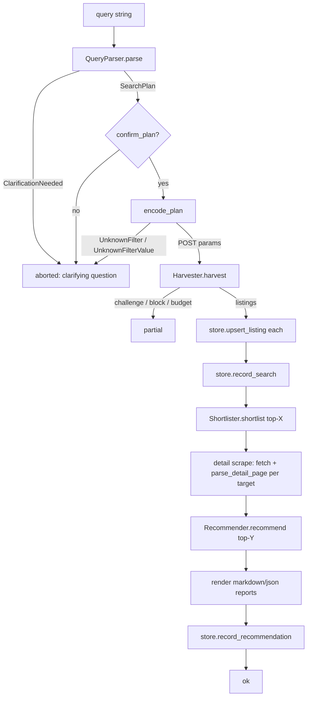

# Architecture: the SearchSession funnel

How the building blocks compose into one search, from a natural-language query
to a rendered report. The orchestration lives in `src/athome_harness/cli.py`
(`SearchSession`, `SessionDeps`, `SearchOutcome`); every stage it calls is a
building block documented in its own page.

* **Depends on:** [LLM](llm.md) (parse, shortlist, recommend),
  [filters](filters.md) (encode), [scraping](scraping.md) (harvest, refarm),
  [parsers](parsers.md) (list, detail), [store](store.md) (persist),
  [providers](providers.md) (factory), [data models](data-models.md).
* **Depended on by:** the CLI entry point and the
  [full-run probe](probes.md#full_run_probepy).

## SessionDeps

The explicit dependency bundle `SearchSession` consumes. Every dependency is
injectable, which is what makes the funnel testable end to end with fakes only
at the network boundary.

| Field | Type | Default | Meaning |
|-------|------|---------|---------|
| `provider` | `BaseLLMProvider` | required | LLM transport (all stages). |
| `filter_map` | `FilterMap` | required | Validated filter map. |
| `store` | `BaseDataStore` | required | Persistence backend. |
| `fetch` | `Callable[[str], str]` | required | URL-to-HTML fetch callable (production: `build_production_fetch`). |
| `build_list_url` | `Callable[[list[tuple[str, str]], int], str]` | required | POST params + page number to list URL. |
| `build_detail_url` | `Callable[[ListingSummary], str]` | required | Summary to detail URL. |
| `report_dir` | `Path` | required | Where session reports are written. |
| `budgets` | `Budgets` | `Budgets()` | Budget knobs. |
| `clock` | `Callable[[], float] \| None` | `None` | Injectable clock. |
| `confirm_plan` | `Callable[[str, SearchPlan], bool] \| None` | `None` | Plan confirmation callback; `None` auto-confirms. |
| `detail_parser` | `Callable[[str], ListingDetail] \| None` | `None` | Injectable detail parser (tests). |

## SearchOutcome

| Field | Type | Meaning |
|-------|------|---------|
| `status` | `str` | `ok`, `partial`, or `aborted`. |
| `session_id` | `str` | UUID of the session. |
| `report` | `RunReport \| None` | Present for `ok` and `partial`. |
| `shortlist` | `list[ListingSummary] \| None` | The shortlist summaries. |
| `recommendations` | `list[Recommendation] \| None` | The ranked recommendations. |
| `clarifying_question` | `str \| None` | Present when the query was ambiguous. |

## The funnel

Stage order and its markers (all logged verbatim): `SESSION_START` ->
`SEARCH_PLAN` -> (`CLARIFY`) -> `FILTER_ENCODE` -> `HARVEST_START` ->
`HARVEST_PAGE` (per page) -> (`BUDGET_HIT` / `PARTIAL_REPORT` /
`ATHOME_CHALLENGE` / `BLOCK_DETECTED` on degradation) -> `HARVEST_DONE` ->
`SHORTLIST_START` / `SHORTLIST_DONE` -> `DETAIL_START` / `DETAIL_DONE` ->
`REPORT` -> `STORE` -> `SESSION_END`.

## Degradation semantics

`SearchSession.search` never raises for site-side problems; it degrades:

* **Clarification needed:** the query is flow-ambiguous, so the session aborts
  with a `clarifying_question`. The CLI surfaces it; the user rephrases.
* **Unknown filter or value:** the plan names something the filter map cannot
  encode, so the session aborts (the `UNKNOWN_FILTER_ENCODED` marker names it).
* **Block, challenge, or budget exhaustion:** the harvester returns a partial
  result (`partial=True` with the abort reason) and the funnel continues with
  whatever listings were already parsed, flagging the report `partial=True`.
  Challenge HTML is never parsed as data (fail closed).
* **Detail scrape failures:** a target whose detail page fails to fetch or
  parse is skipped and counted in `DETAIL_DONE failed=<n>`; the run continues.

This is why `RunReport.partial` exists: the operator can tell a complete run
from a degraded one at a glance.

## Command loop

After a search the session exposes a feedback command loop
(`parse_command(text) -> Command`): `save`/`reject` (store feedback),
`more_like` (find similar), `refine` (new query), `quit`. Feedback is stored
through the same store boundary and shapes future shortlists (rejected
listings are excluded from candidates).

## Testing conventions

The funnel is tested with `SessionDeps` constructed from fakes at the network
boundary only: a fake fetch serving fixture HTML, a fake provider with canned
schema-valid responses, and a real `SqliteStore` against a temp file. The
scripted e2e run (`tests/e2e/test_scripted_e2e.py`) walks the full
query-to-report journey this way; no test performs live network I/O. The
[full-run probe](probes.md#full_run_probepy) is the operator-facing equivalent
of this convention.
