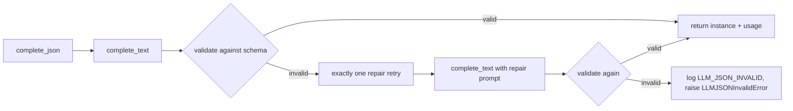

# LLM layer

The language-model building blocks under `src/athome_harness/llm/`. This layer
turns a natural-language housing wish into a structured plan, scores harvested
listings into a shortlist, and ranks shortlisted details into the final
recommendations. Every stage is schema-validated through the shared
`complete_json` path with token accounting, exactly-one JSON repair retry, and a
bounded transport retry for transient provider failures.

* **Depends on:** [data models](data-models.md) (`SearchPlan`,
  `ListingSummary`, `ListingDetail`, `Recommendation`, `FilterMap`),
  [config](config.md) (default models, temperature, token ceilings).
* **Depended on by:** the [architecture funnel](architecture.md)
  (`SearchSession` composes `QueryParser`, `Shortlister`, `Recommender`) and
  the [providers factory](providers.md) (builds the concrete transport).

## BaseLLMProvider

`llm/base.py` is the abstract contract every transport implements (the Abstract
First invariant: no HTTP client is imported here).

| Member | Signature | Meaning |
|--------|-----------|---------|
| `complete_text` | `(self, *, system: str, user: str, temperature: float = 0.0) -> tuple[str, LLMUsage]` | Abstract primitive: raw completion text plus usage. |
| `complete_json` | `(self, *, system: str, user: str, schema: type[SchemaT], temperature: float = 0.0) -> tuple[SchemaT, LLMUsage]` | Schema-validated completion with repair retry (concrete, shared). |
| `total_usage` | `property -> LLMUsage` | Cumulative usage across `complete_json` calls. |
| `total_tokens` | `property -> int` | Cumulative prompt + completion tokens. |

`complete_json` is the only path production consumers use. Its behavior:

1. Calls `complete_text` and records usage. The shared transport makes at most
   two total attempts for a transport exception or HTTP 5xx response, with a
   bounded one-second delay and `[LLM_TRANSPORT_RETRY]` marker.
2. Parses and validates the completion against `schema`. On success returns the
   validated instance with the first successful call's usage.
3. On `ValidationError` or `JSONDecodeError` it runs **exactly one** JSON repair
   retry: `complete_text` again with an explicit instruction to return valid
   JSON for the schema. This is separate from transport retry.
4. If the repair also fails it logs the `LLM_JSON_INVALID` marker and raises
   `LLMJSONInvalidError` (a subclass of `LLMProviderError`). A terminal
   transport failure logs `[LLM_TRANSPORT_FAILED]` and is not mislabeled as JSON
   invalid.

The recommender passes `debug_stage="recommender"`. With `DEBUG=true`, stable
ignored files `debug/llm_recommender_input.json` and
`debug/llm_recommender_output.json` are overwritten on each run. The request
capture is written before transport, so it remains available when the provider
times out; the response capture is written only when raw response text exists.

`LLMUsage` fields: `prompt_tokens: int`, `completion_tokens: int` (both `>= 0`,
default `0`), plus the derived `total` / `total_tokens` properties.

Errors: `LLMProviderError` (transport, auth, or configuration failures) and
`LLMJSONInvalidError` (schema failure after repair). Neither ever carries
credential material.

## OpenAICompatibleProvider (shared transport base)

`llm/openai_compat.py` factors the shared wire contract used by OpenRouter
and OpencodeGo: messages payload, JSON response format, optional `max_tokens`,
and safe error handling. Concrete transports can opt into provider-specific
reasoning controls without changing the shared fallback behavior.

When `max_tokens` is configured, it remains the total completion ceiling,
including reasoning and visible JSON. The universal payload policy sends both
`max_tokens` and `max_completion_tokens` with the same configured value, plus a
qualitative `reasoning_effort` value (`low` by default). `max_output_tokens` is
not sent because the live OpenCodeGo `glm-5.2` gateway rejects it.

Live compatibility probes on 2026-09-13 established:

| Model | `max_tokens` | `max_completion_tokens` | `max_output_tokens` | nested `reasoning` |
|---|---:|---:|---:|---:|
| OpenCodeGo `glm-5.2` | accepted | accepted | rejected | rejected |
| OpenCodeGo `deepseek-v4-flash` | accepted | accepted | accepted | accepted in tested request |

Because the universal request must work for `glm-5.2`, numeric
`reasoning.max_tokens` is not sent. Desired numeric budgets remain internal
policy and telemetry until a common accepted field is verified. The planned
levels are `low=2500`, `medium=5000`, and `high=8000`, but these values are not
claimed to be enforced by every gateway. Usage telemetry must compare requested
policy with returned `reasoning_tokens`, `completion_tokens`, and
`finish_reason`.

OpenCodeGo's `/zen/go/v1/chat/completions` gateway is OpenAI-compatible but
model validation differs by model. The adapter therefore uses only the fields
proven universal for the active GLM route and records response usage for
compatibility monitoring.

### Reasoning policy by stage

The harness currently makes four logical call types:

| Stage | Calls | Reasoning policy |
|---|---|---|
| Flow detection | One small `rent` vs `buy` JSON call | Disable or minimize reasoning when the provider supports it. |
| Query parsing | One structured intent JSON call, with one repair retry possible | Low effort. |
| Shortlisting | One call per token-bounded listing batch | Low by default because this is the main call-volume and latency hotspot. |
| Recommender | One final ranking call, with one repair retry possible | Medium is a future candidate because it compares already-shortlisted details; keep low for bounded live probes initially. |

The current provider interface does not yet expose a per-call reasoning setting;
these stage policies are the next implementation target. No reasoning should be
used for deterministic repair instructions beyond what the provider requires.

`__init__` parameters:

| Parameter | Type | Default | Meaning |
|-----------|------|---------|---------|
| `api_key` | `str \| None` | `None` | Key; falls back to the subclass `env_api_key` environment variable. |
| `model` | `str` | `DEFAULT_GENERAL_MODEL` (subclasses override) | Completion model. |
| `session` | `ChatSession \| None` | `None` | Injectable transport for tests. |
| `base_url` | `str \| None` | `None` | Endpoint override; defaults to the subclass `default_base_url`. |
| `max_tokens` | `int \| None` | `None` | API-level completion ceiling (`ATHOME_LLM_MAX_TOKENS`); `None` uses the endpoint default. |

Class attributes subclasses declare: `provider_name` (error label),
`default_base_url`, `env_api_key`. An empty resolved key or URL raises
`LLMProviderError` at construction, so a missing credential fails loudly
instead of silently using a real secret.

Error handling: transport exceptions raise `LLMProviderError` carrying only the
exception type name (never the message body); non-2xx responses raise with the
status code only; an unparseable body raises a typed error instead of leaking
raw content.

## OpenRouterProvider / OpenCodeGoProvider

Thin declarations over the shared base:

| Provider | `env_api_key` | Default model | Endpoint |
|----------|---------------|---------------|----------|
| `OpenRouterProvider` (`llm/openrouter.py`) | `OPENROUTER_API_KEY` | `deepseek/deepseek-v4-flash-0731` | `https://openrouter.ai/api/v1/chat/completions` |
| `OpenCodeGoProvider` (`llm/opencodego.py`) | `OPENCODEGO_API_KEY` | `opencode-go/deepseek-v4-flash` | `https://opencode.ai/zen/go/v1/chat/completions` |

OpenCodeGo additionally sends `User-Agent: athome-japan-agent-harness/0.1.0`
and a generated `x-opencode-session` UUID. The UUID is created once per provider
instance and reused for every completion in that conversation; it is never
logged, persisted, or shared across application processes. OpenRouter keeps the
shared authorization and content-type headers only.

Selection is config-driven (`ATHOME_LLM_PROVIDER`) through
[`build_llm_provider`](providers.md); both transports use the same shared base
so switching is a config change, not a code change.

## QueryParser

`llm/query_parser.py` turns a natural-language query into a
[`SearchPlan`](data-models.md#searchplan).

`__init__(provider: BaseLLMProvider, filter_map: FilterMap)`. The filter map is
summarized into the prompt so the model can only emit canonical filter names.

`parse(query: str, *, temperature: float = 0.0) -> SearchPlan`:

1. Resolves the flow (`rent` or `buy`) from the query. Flow ambiguity raises
   `ClarificationNeeded(question)`, which the CLI surfaces as a clarifying
   question and aborts the session.
2. Asks the provider for a `ParserOutput` (schema-validated through
   `complete_json`).
3. Resolves the output against the filter map: every hard-filter name and value
   must be known, otherwise the plan drops or rejects the filter (see
   [filters](filters.md)).

`ParserOutput` fields: `flow`, `prefecture`, `cities: list[str]`,
`ambiguous: bool`, `clarification_question: str | None`,
`hard_filters: dict[str, list[str]]`, `soft_prefs: list[str]`.

## Shortlister

`llm/shortlister.py` scores harvested `ListingSummary` values against the soft
preferences and returns an ordered top-X shortlist.

`__init__(provider: BaseLLMProvider, *, chars_per_token: int = 4,
max_batch_tokens: int = 6000, max_workers: int = 2)`.

`shortlist(prefs: list[str], listings: list[ListingSummary], *,
top_x: int | None = None, temperature: float = 0.0) -> list[ShortlistEntry]`:

1. Serializes every listing to compact text (`_serialize`) and estimates tokens
   (`len(text) / chars_per_token`).
2. Packs listings into batches bounded by `max_batch_tokens` (default 6000) so
   one prompt never exceeds the budget.
3. Scores up to two batches concurrently through `complete_json` against
   `ShortlistBatch`; failed batches are logged and omitted while other results are retained.
4. Merges entries, sorts by score descending, and returns the top X
   (`DEFAULT_TOP_X` = 20 when `top_x` is `None`; the session passes
   `Budgets.shortlist_size`).

`ShortlistEntry` fields: `listing_id: str`, `score: float` (0 to 10),
`rationale: str`. `ShortlistBatch` holds `entries: list[ShortlistEntry]`.

## Recommender

`llm/recommender.py` ranks `ListingDetail` values into the top-Y
recommendations and renders the report.

`__init__(provider: BaseLLMProvider)`.

`recommend(details: list[ListingDetail], plan: SearchPlan, *,
top_y: int | None = None, temperature: float = 0.0) -> list[Recommendation]`:

1. Describes the plan's constraints to the model.
2. Serializes each detail and asks for a ranked
   `RecommendationOutput` via `complete_json`.
3. Hydrates each ranked entry with its `ListingSummary` and returns
   [`Recommendation`](data-models.md#recommendation) values in rank order,
   including `satisfied_constraints`, `violated_constraints`, and Probable
   Negatives carried through as caveats. `DEFAULT_TOP_Y` = 5 when `top_y` is
   `None`; the session passes `Budgets.recommendations_count`.

Module functions `render_markdown(recommendations, query) -> str` and
`render_json(recommendations) -> str` produce the operator-facing report files
written under the session's `report_dir`.

## Token and repair loop summary

Scoring temperature is 0 by default (`Budgets.llm_temperature`) and the
completion ceiling is `Budgets.llm_max_tokens` (default 2048), mapped by the
factory to the transport's `max_tokens` argument.
