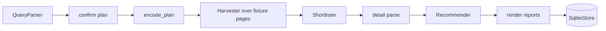

# Operator probes

The operator-facing probe scripts under `scripts/`, added in the M4 docs
milestone (PR #16) and hardened afterward. They exist so an operator can verify
each stage of the funnel in isolation, safely, before running the whole search
live. All three are bounded, fail closed, and redact sensitive material.

* **Depends on:** every layer through the [providers factory](providers.md) and
  the [parsers](parsers.md), [LLM](llm.md) stages, and the
  [architecture](architecture.md) funnel.
* **Depended on by:** operators; nothing in production depends on a probe.

Shared helpers live in `scripts/probe_common.py`:

| Helper | Signature | Meaning |
|--------|-----------|---------|
| `ProbeContentError` | `(stage, source, reason)` exception | Raised when fetched/loaded content fails validation. |
| `validate_page_content` | `(html: str, *, stage: str, source: str) -> None` | Reject empty/too-short pages and challenge pages before parsing or saving. |
| `safe_artifact_path` | `(debug_dir: Path, name: str) -> Path` | Build a safe path inside the debug dir, refusing traversal. |
| `redact_diagnostics` | `(raw: str) -> str` | Redact proxy credentials, API keys, cookies from diagnostic text. |

## property_rental_probe.py

Bounded single-property probe. Verifies the list page parse and, optionally,
the detail page parse for one listing. Basic verification is offline
(`--input-mode fixture`); the URL mode performs live network I/O through the
production fetch path (`build_production_fetch`, which wraps `SessionRefarmer`
for the refarm-on-block fallback).

| Argument | Type | Default | Meaning |
|----------|------|---------|---------|
| `--input-mode` | `url` \| `fixture` | `url` | Live fetch or offline fixture parse. |
| `--url` | `str` | Osaka rental list URL | The AtHome list page to probe. |
| `--list-html` | `Path` | `None` | Captured list HTML (fixture mode). |
| `--detail-html` | `Path` | `None` | Optional captured detail HTML (fixture mode). |
| `--debug-dir` | `Path` | `debug` | Directory for probe artifacts. |
| `--timeout` | `float` | `20.0` | Per-request timeout in seconds. |

Stages and safety:

1. **Fetch or load**: in URL mode, fetch through the production fetch callable
   (a block surfaces via `BlockDetected`, never a challenge parse); in fixture
   mode, read the file. Either way `validate_page_content` rejects challenge
   pages before anything is parsed or written.
2. **Parse list**: `parse_list_page` into summaries; zero listings is an error.
3. **Parse detail** (when a detail page is provided): `parse_detail_page`, and
   the summary fields are overridden by the detail fields.
4. **Write artifacts**: validated content is written under `--debug-dir` only
   after validation passes; diagnostics are redacted through
   `redact_diagnostics`.

## llm_probe.py

Bounded LLM probe. Exercises the configured provider through
`BaseLLMProvider.complete_json` with a schema-validated result and reports
token usage. Basic verification is offline (`--fake`).

| Argument | Type | Default | Meaning |
|----------|------|---------|---------|
| `--provider` | `str` | configured (`openrouter`) | `openrouter` or `opencodego`. |
| `--model` | `str` | configured model | Model identifier override. |
| `--prompt` | `str` | canned default prompt | Prompt to send. |
| `--fake` | flag | off | Use a canned no-network provider instead of the configured transport. |

Safety: never prints credentials; the provider is built from the environment
only, and the probe fails clearly (exit code 1 with a message naming the
missing key) when the requested provider's credential is absent rather than
silently using a real secret. In `--fake` mode a canned
`OpenAICompatibleProvider`-shaped fake returns a fixed schema-valid response
with synthetic usage, so the whole `complete_json` path runs with zero network.

## full_run_probe.py

Bounded full-run probe. Composes the real funnel in the same order as
`SearchSession`: query parse, plan confirmation, filter encode, harvest,
shortlist, detail scrape, recommend, render report, store. Default mode is
offline over fixture HTML; live network is explicit opt-in (`--mode live`).

| Argument | Type | Default | Meaning |
|----------|------|---------|---------|
| `--mode` | `fixture` \| `live` | `fixture` | Offline fixture run or live network. |
| `--query` | `str` | canned default query | Natural-language query. |
| `--work-dir` | `Path` | `.probe-work` | Throwaway directory for reports and the session store. |
| `--keep-outputs` | flag | off | Keep the work directory instead of removing it on exit. |

In fixture mode the probe builds `SessionDeps` with fixture-backed fakes at the
network boundary only: the fetch callable serves fixture list HTML per page,
the LLM provider is a canned fake, and the store is a real `SqliteStore` in the
throwaway work dir. Real project code paths (`QueryParser`, `encode_plan`,
`Harvester`, `Shortlister`, `Recommender`, detail parsing, report rendering)
all execute. The work directory is removed on exit unless `--keep-outputs`;
`.probe-work/` is also gitignored as a safety net for hard kills.



In live mode the same funnel runs with `build_production_fetch` for the fetch
dependency, so the refarm-on-block path is exercised exactly as production
would. Challenge handling is never bypassed: a challenge page fails closed.

## Running the probes

```bash
# Offline verification (no network, safe in CI)
python scripts/property_rental_probe.py --input-mode fixture --list-html tests/fixtures/osaka_rental_list.html --debug-dir /tmp/probe-debug
python scripts/llm_probe.py --fake
python scripts/full_run_probe.py --mode fixture

# Live (performs real network I/O; human use only)
python scripts/property_rental_probe.py --url https://www.athome.co.jp/chintai/osaka/list/
python scripts/full_run_probe.py --mode live
```

Every probe is safe to inspect with `--help` (no side effects). LLM live mode
requires the provider credential to be present in the environment.
