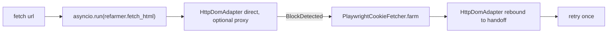

# Providers factory

The composition root in `src/athome_harness/providers.py`. Every concrete class
is constructed here and nowhere else in production code, which keeps the
Abstract First invariant real: business logic names only the abstract types
(`BaseLLMProvider`, `BaseDataStore`, `BaseScraper`, `ProxyProvider`) and the
factory wires concrete transports with lazy imports.

* **Depends on:** [config](config.md) (`Settings`, `Budgets`) and every
  concrete implementation module (lazily).
* **Depended on by:** the [architecture funnel](architecture.md) (the CLI
  builds its `SessionDeps` through it), and the operator probes
  ([probes.md](probes.md)) for their live modes.

## build_proxy_provider(settings, budgets) -> ProxyProvider | None

**Signature:** `build_proxy_provider(settings: Settings, budgets: Budgets) ->
ProxyProvider | None`.

Webshare credentials are optional. When either `WEBSHARE_PROXY_USER` or
`WEBSHARE_PROXY_PASS` is unset this returns `None` (logging `[PROXY_DISABLED]`)
so the HTTP adapter runs direct-only instead of failing at construction. When
both are set it returns `WebshareProxyProvider`.

## build_llm_provider(settings) -> BaseLLMProvider

**Signature:** `build_llm_provider(settings: Settings) -> BaseLLMProvider`.

Maps `settings.llm_provider` to a concrete transport:

| Provider value | Transport | Key used | Model source |
|----------------|-----------|----------|--------------|
| `openrouter` (default) | `OpenRouterProvider` | `openrouter_api_key` | `general_model` |
| `opencodego` | `OpenCodeGoProvider` | `opencodego_api_key` | `opencodego_model` |

Any other value raises `ValueError` naming the expected values. The
`llm_max_tokens` budget is passed through as the transport's `max_tokens`.

## build_store(settings) -> BaseDataStore

**Signature:** `build_store(settings: Settings) -> BaseDataStore`.

Maps `settings.store_provider` to a concrete backend. Only `sqlite` is
supported today (`SqliteStore(settings.store_path)`); anything else raises
`ValueError`.

## build_production_fetch

**Signature:** `build_production_fetch(budgets: Budgets | None = None,
settings: Settings | None = None) -> Callable[[str], str]`.

Builds the production page-fetch callable over the `SessionRefarmer` fallback
loop, exposing the async refarm pipeline as a synchronous URL-to-HTML callable:

* The scraper adapter is selected by `settings.scraper_provider` (only `http`
  is supported; anything else raises `ValueError`).
* Proxy rotation is optional: `build_proxy_provider` returns `None` without
  Webshare credentials, and the adapter runs direct-only.
* **This path performs live network I/O and is intended for human use only.**
  Tests and the scripted e2e run inject fakes; the probes use it only in their
  explicit live modes.

## load_settings() -> Settings

Loads `Settings` from the `.env` file plus the real environment (real env
wins). Referenced by the CLI and the probes; unknown `ATHOME_*` keys fail
loudly here (see [config](config.md)).
