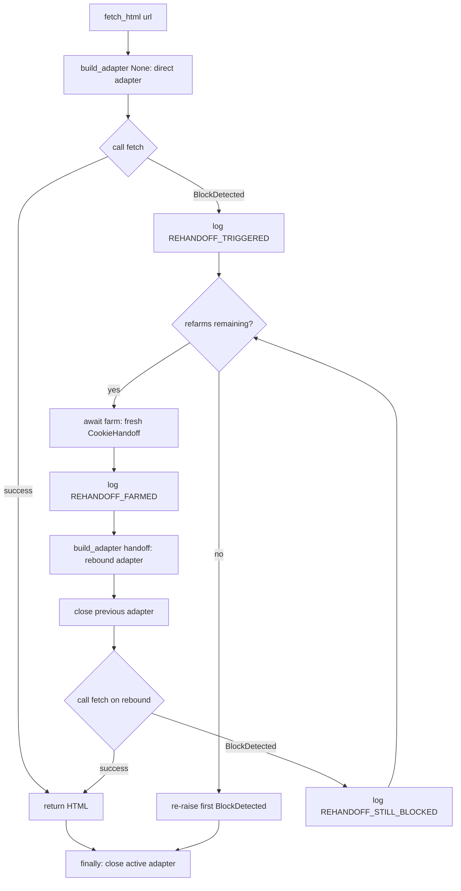
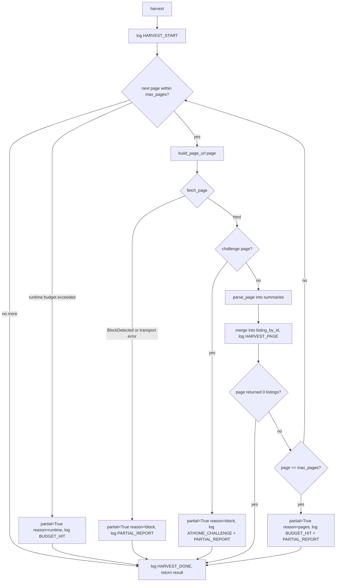

# Scraping layer

The network and recovery building blocks, under `src/athome_harness/scraping/`.
This layer owns every byte that crosses the network to AtHome: the synchronous
HTTP adapter, the async browser cookie farmer, the refarm orchestrator that ties
them together, the pagination engine, and the proxy rotation policy.

* **Depends on:** [data models](data-models.md) (`ListingSummary`),
  [config](config.md) (`Budgets`), and the challenge detector in
  `scraping/challenge.py`.
* **Depended on by:** the [parsers](parsers.md) (which consume fetched HTML),
  the [providers factory](providers.md) (which wires the production fetch), and
  the [architecture funnel](architecture.md).

The Abstract First invariant is enforced here: `curl-cffi` and `patchright` are
imported only inside adapters, never in business logic.

## BaseScraper and BlockDetected

`BaseScraper` (`scraping/base.py`) is the abstract contract every fetch backend
implements.

| Method | Signature | Returns | Raises |
|--------|-----------|---------|--------|
| `fetch_html` | `(url: str) -> str` | Raw HTML source | `BlockDetected` |
| `fetch_binary` | `(url: str) -> bytes` | Raw body bytes | `BlockDetected` |

`BlockDetected` is raised when the site blocks a request. It carries:

| Attribute | Type | Meaning |
|-----------|------|---------|
| `url` | `str` | The original request URL. |
| `redacted_url` | `str` | The URL with credentials and query string stripped. |
| `signature` | `BlockSignature` | The block kind (`403`, `429`, or a captcha marker). |

Constructing a `BlockDetected` logs the `[BLOCK_DETECTED]` marker verbatim with
the redacted URL and signature. Callers never see credentials.

`redact_url(url: str) -> str` strips the user-info and query string from a URL
so diagnostics never leak proxy credentials or private parameters.

## ProxyProvider (protocol)

The minimal rotation interface the HTTP adapter depends on. Implementations are
direct-first: `get_proxy()` returns `None` until a block is reported.

| Method | Signature | Returns |
|--------|-----------|---------|
| `get_proxy` | `() -> str \| None` | Current proxy URL, or `None` for direct. |
| `report_block` | `(url: str) -> str \| None` | Next proxy URL, or `None` when the retry budget is spent. |

### WebshareProxyProvider

`scraping/proxy/webshare.py` implements `ProxyProvider` over the Webshare
rotating gateway. The cheapest plan uses one credentialed gateway URL, so the
pool has length one by design; the retry budget (`Budgets.proxy_retries`,
default 3), not the pool size, bounds consecutive proxy attempts. Construction
raises `ValueError` when either credential is missing, which is why the
[providers factory](providers.md) only builds it when both
`WEBSHARE_PROXY_USER` and `WEBSHARE_PROXY_PASS` are set.

## HttpDomAdapter

`scraping/http_adapter.py` is the production synchronous scraper: `curl-cffi`
for the request, `selectolax` for DOM parsing. It is intentionally synchronous;
SPEC FR-5 forbids automatic async refarming inside it (that lives in
`SessionRefarmer`).

`__init__` parameters:

| Parameter | Type | Default | Meaning |
|-----------|------|---------|---------|
| `budgets` | `Budgets` | required | Timeout and retry budgets. |
| `proxy_provider` | `ProxyProvider \| None` | `None` | Rotation policy; ignored when a handoff is bound. |
| `handoff` | `CookieHandoff \| None` | `None` | A farmed browser session to replay. |
| `impersonate` | `ImpersonateProfile` | `"chrome"` | curl-cffi browser fingerprint. |
| `client` | `CurlSession \| None` | `None` | Injectable session for tests. |
| `sleep_fn` | `Callable[[float], None] \| None` | `None` | Injectable sleep for deterministic tests. |
| `debug` | `bool` | `False` | Capture each raw response in `raw_response`. |

Public surface beyond `fetch_html`/`fetch_binary`:

| Member | Type | Meaning |
|--------|------|---------|
| `fetch_dom` | `(url: str) -> HTMLParser` | Fetch and return a parsed selectolax DOM. |
| `raw_response` | `CurlResponse \| None` (property) | The last raw response, only when `debug=True`. |
| `close` | `() -> None` | Release the owned curl session. |

Behavior notes:

* When a `handoff` is bound, the adapter replays the exact headers, cookies, and
  impersonation profile the browser session established, and proxy rotation is
  disabled (the handoff already carries its proxy).
* Transient network errors are retried with exponential backoff
  (`_TRANSIENT_RETRIES = 3`, base `0.5s`, max `8s`) before a block is declared.
* A response whose body matches an AtHome challenge marker, or whose status is a
  block signature, raises `BlockDetected`; the challenge HTML is never returned
  as content.

## CookieHandoff

`scraping/cookie_handoff.py` is the typed, versioned record a browser farmer
produces and the HTTP adapter consumes. `HANDOFF_SCHEMA_VERSION = 1`.

| Field | Type | Meaning |
|-------|------|---------|
| `proxy_identity` | `str` | Redacted proxy label for logs. |
| `proxy_url` | `str \| None` | The proxy the browser session used. |
| `user_agent` | `str` | The browser user agent. |
| `headers` | `dict[str, str]` | The real navigation request headers. |
| `cookies` | `tuple[dict[str, object], ...]` | The browser cookies. |
| `created_at` | `str` | ISO timestamp. |
| `impersonate` | `ImpersonateProfile` | `"chrome"` or `"safari_ios"`. |
| `schema_version` | `int` | Handoff schema version. |

Key methods: `from_browser(...)` builds one from a live browser;
`to_curl_cffi_kwargs()` renders the kwargs the HTTP adapter replays; `save()` /
`load()` persist it atomically. The handoff and the derived `session_state.json`
are credentials-adjacent and must stay in git-ignored debug paths, never in
fixtures, logs, or commits.

## PlaywrightCookieFetcher

`scraping/playwright_cookie_fetcher.py` is the async Patchright farmer. It
renders AtHome in a persistent browser context, performs one bounded
verification click if challenged, and persists a `CookieHandoff` plus
`session_state.json`. It is deliberately lean: screenshots, trace, video, and
the structured event log live in the operator probe, not here.

Selected `__init__` parameters (all keyword-only):

| Parameter | Type | Default | Meaning |
|-----------|------|---------|---------|
| `url` | `str` | Osaka rental list URL | Page to render. |
| `proxy_url` | `str \| None` | `None` | Proxy for the browser session. |
| `debug_dir` | `Path` | `debug` | Where the handoff and session state are written. |
| `wait_seconds` | `float` | `3.0` | Settle wait after the page signal. |
| `min_html_length` | `int` | `200` | Minimum rendered length to accept. |
| `capsolver_key` | `str \| None` | `None` | Optional CapSolver key (see safety note). |

`farm() -> CookieHandoff` is the single async entry point.

> **Safety boundary.** Automated CAPTCHA/WAF solving, external solver services,
> and replay of clearance tokens require explicit security authorization and
> separate review (see `AGENTS.md`). The default path detects a challenge and
> fails closed; the CapSolver hooks exist but are gated behind an explicit key
> and are not part of the default scraper path.

## SessionRefarmer

`scraping/session_refarmer.py` orchestrates the production recovery loop. The
HTTP adapter is synchronous, so this separate async layer owns the fallback:
when a fetch raises `BlockDetected`, it farms a fresh browser session, rebinds
the adapter to that handoff, and retries once.

`__init__` parameters:

| Parameter | Type | Default | Meaning |
|-----------|------|---------|---------|
| `build_adapter` | `Callable[[CookieHandoff \| None], object]` | required | Build a sync scraper from a handoff (`None` = direct). |
| `farm` | `Callable[[], Awaitable[CookieHandoff]]` | required | Produce a fresh handoff. |
| `max_refarms` | `int` | `1` | How many times a block may trigger a refarm before giving up. |

Public methods `fetch_html(url) -> str` and `fetch_binary(url) -> bytes` are
async and run the loop below.

### SessionRefarmer flow

Every adapter the loop creates is closed exactly once: the previous adapter is
closed when a rebound one replaces it, and the `finally` closes whichever
adapter is active on exit. This is the cleanup pattern PR #10 hardened; do not
regress it.

## Harvester

`scraping/harvester.py` is the budget-aware pagination engine. It is transport
agnostic: the caller injects `fetch_page`, so the same engine runs over the live
production fetch or a fixture fake.

`__init__` parameters (all keyword-only):

| Parameter | Type | Default | Meaning |
|-----------|------|---------|---------|
| `fetch_page` | `Callable[[str], str]` | required | Return the HTML of a page URL. |
| `parse_page` | `Callable[[str], list[ListingSummary]]` | required | Parse page HTML into summaries. |
| `build_page_url` | `Callable[[int], str]` | required | Map a 1-based page number to its URL. |
| `budgets` | `Budgets` | required | Page and runtime budgets. |
| `clock` | `Callable[[], float] \| None` | `None` | Injectable clock for deterministic tests. |

`harvest(*, expected_pages: int = 0) -> HarvestResult` runs the loop.

`HarvestResult` fields:

| Field | Type | Meaning |
|-------|------|---------|
| `listings` | `list[ListingSummary]` | Deduped listings keyed by `internal_id`. |
| `pages_scraped` | `int` | Number of pages fetched. |
| `partial` | `bool` | True when the harvest was cut short. |
| `abort_reason` | `AbortReason \| None` | `"pages"`, `"runtime"`, or `"block"`. |

### Harvester flow

Termination rules, in order:

1. A page that parses to zero listings ends the loop naturally with
   `partial=False` (the result set is exhausted).
2. Hitting the page budget (`Budgets.max_pages`, default 100) sets
   `partial=True`, `abort_reason="pages"`.
3. Exhausting the runtime budget (`Budgets.runtime_minutes`, default 30) sets
   `partial=True`, `abort_reason="runtime"`.
4. A `BlockDetected`, any other fetch failure, or a detected challenge page sets
   `partial=True`, `abort_reason="block"` and fails closed without parsing the
   challenged HTML.

Listings are deduplicated by `internal_id`, so a listing that appears on two
pages is counted once.
